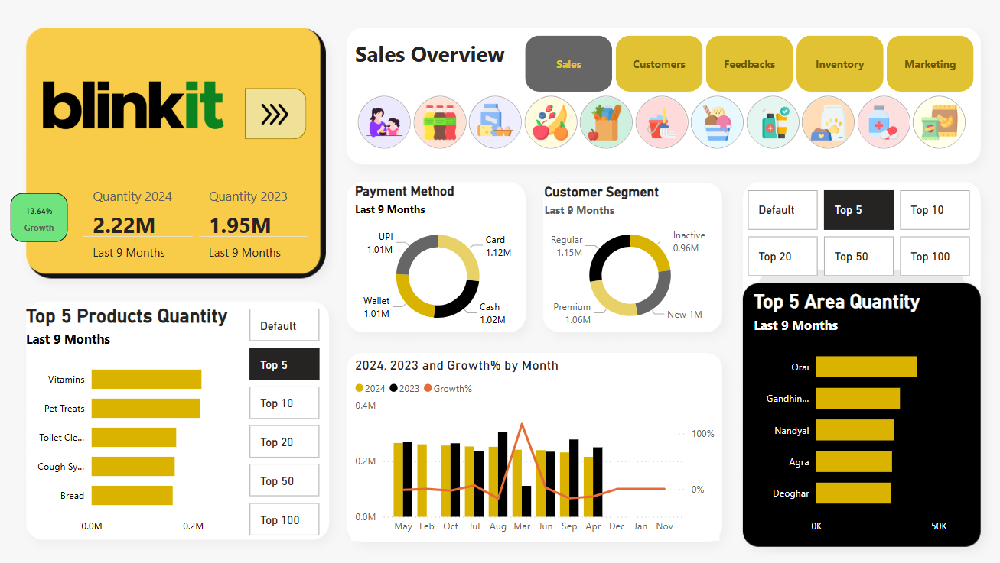
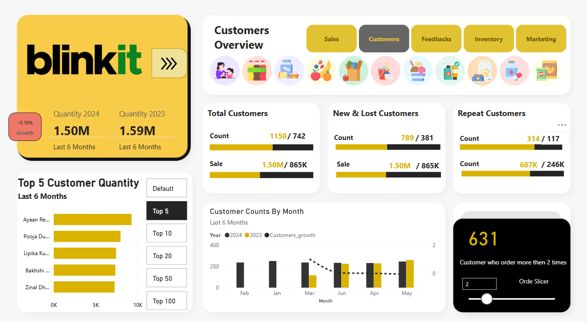

### BlinkIt Performance Analysis Using PowerBI

This project features a Power BI dashboard analyzing Blinkit's sales data, delivery efficiency, customer trends, marketing performance, Iventory analysis, Feedbacks .

### Key Features:
- Visual KPIs: Monthly sales, avg. delivery time, customer growth
- Power Query for data cleaning
- DAX for custom KPIs and calculated columns

[Dashboard Overview](Dashboard_Screenshots/Blinkit_Feedbacks.png)
[Dashboard Overview](Dashboard_Screenshots/Blinkit_Inventory.png)
[Dashboard Overview](Dashboard_Screenshots/Blinkit_Marketing.png)

## Tools Used:
- Power BI
- Power Query
- DAX

